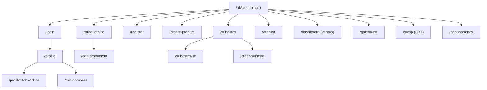
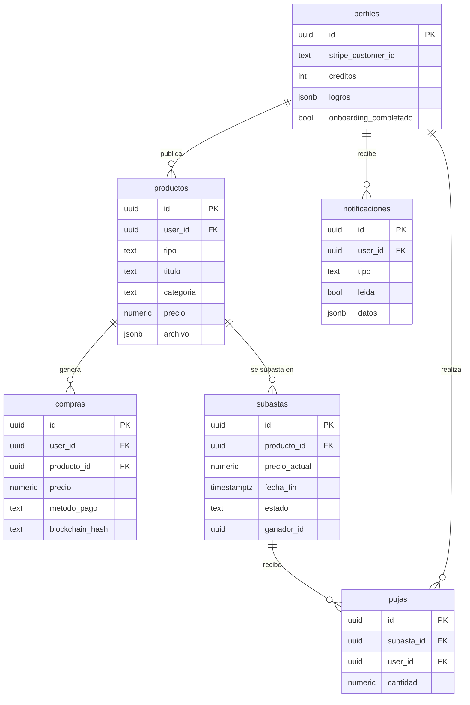

# ScriptBay

**Marketplace de scripts y servicios digitales con licencias verificadas en blockchain.**

| | |
|---|---|
| **Proyecto** | ScriptBay |
| **Autores** | Enrique Rincón · Marcos Ruiz González · Alejandro Millán |
| **Año académico** | 2025 / 2026 |
| **Ciclo** | CFGS Desarrollo de Aplicaciones Web (DAW) |
| **Centro** | _IES (completar nombre del centro)_ |

---

## 1. Introducción y justificación

ScriptBay es una plataforma web donde desarrolladores pueden vender y comprar recursos digitales: scripts, plantillas, plugins, componentes de interfaz, APIs y servicios. La idea parte de un problema concreto: cuando compras código en un marketplace tradicional no tienes ninguna prueba real de que la licencia es tuya, y el vendedor podría revender el mismo recurso sin control. Quisimos resolver eso emitiendo, en cada compra, una **licencia NFT** que queda registrada en una cadena pública y sirve como justificante de propiedad imposible de falsificar.

Sobre esa base montamos un marketplace completo: publicación de productos, pagos con tarjeta y con PayPal, un sistema de **subastas con pujas en tiempo real**, chat entre comprador y vendedor, reseñas, notificaciones y un panel de ventas para el vendedor.

**Finalidad.** Dar a los creadores de software un sitio donde monetizar su trabajo con una capa de confianza extra (la licencia on-chain) y, de paso, ofrecer al comprador una galería donde consultar todo lo que ha adquirido directamente desde su wallet.

**Objetivos una vez en marcha.** Registrarse e iniciar sesión, publicar un producto (que antes de hacerse público pasa por un escaneo automático de seguridad), comprarlo por varios métodos de pago, recibir la licencia NFT en la wallet, pujar en subastas, dejar reseñas y gestionar todo desde el perfil.

**Motivación.** Buscábamos un proyecto que nos obligara a tocar tecnologías que no se ven en clase —principalmente la integración con contratos inteligentes y con pasarelas de pago reales en modo prueba— sin renunciar a un producto que se sostenga por sí mismo como aplicación web. La parte de blockchain fue la excusa para aprender Solidity, Foundry y la librería viem, y el resto del proyecto nos sirvió para consolidar todo lo del ciclo.

---

## 2. Análisis y diseño del proyecto

### 2.1. Arquitectura web

ScriptBay sigue una arquitectura **cliente-servidor desacoplada** con tres piezas que se comunican por HTTP y por RPC:

- **Frontend SPA** (Single Page Application) en React. Se descarga una vez y a partir de ahí la navegación es interna; los datos se piden a la API por `fetch`.
- **Backend REST API** en Node.js/Express. No renderiza vistas, solo expone endpoints JSON y orquesta los servicios externos (base de datos, pagos, correo, escaneo y blockchain).
- **Contratos inteligentes** desplegados en la red de pruebas **Sepolia** de Ethereum. El backend escribe en ellos al confirmar una compra y el frontend los lee directamente desde la wallet del usuario.

```
┌─────────────┐    REST/JSON   ┌─────────────┐   supabase-js   ┌──────────────┐
│  Frontend   │ ─────────────▶ │   Backend   │ ──────────────▶ │  Supabase    │
│ React (SPA) │ ◀───────────── │  Express    │ ◀────────────── │ Postgres+Auth│
└──────┬──────┘                └──────┬──────┘                 └──────────────┘
       │                              │
       │ wagmi/viem (lectura)         │ viem (escritura: mint NFT)
       ▼                              ▼
┌─────────────────────────────────────────────┐    ┌──────────────────────────┐
│   Contratos en Ethereum Sepolia (ERC-721 /   │    │ Stripe · PayPal · Mailjet │
│   ERC-20 / Swap)                             │    │ n8n + Gemini (escaneo)    │
└──────────────────────────────────────────────┘    └──────────────────────────┘
```

El backend internamente se organiza por capas (ver punto 2.6), de modo que la lógica de negocio queda separada de la definición de rutas y de la comunicación con servicios de terceros.

### 2.2. Tecnologías y herramientas

**Frontend**
- React 19 + Vite 7 como bundler y servidor de desarrollo.
- React Router 7 para el enrutado de la SPA.
- TailwindCSS 4 para los estilos, con un pequeño *design system* propio (`components/design-system`).
- Framer Motion para animaciones y transiciones.
- wagmi + viem + RainbowKit para la conexión con la wallet (MetaMask) y la lectura de contratos.
- TanStack Query, Recharts (gráficas del dashboard), tsparticles y three/vanta (fondos).

**Backend**
- Node.js con Express 5 (módulos ES).
- `@supabase/supabase-js` como cliente de base de datos y autenticación.
- `jsonwebtoken` y refresh tokens para la sesión.
- `multer` para la subida de archivos y `pdfkit` para generar facturas en PDF.
- `viem` (y `ethers`) para firmar y enviar transacciones a Sepolia.

**Base de datos**
- PostgreSQL gestionado por **Supabase**, que además aporta el sistema de autenticación (`auth.users`) y almacenamiento.

**Blockchain**
- Solidity con **Foundry** (forge) para compilar, testear y desplegar.
- Contratos basados en **OpenZeppelin** (incluido como submódulo de Git).
- Red de pruebas Sepolia, para no operar con dinero real.

**Integración, seguridad y otras herramientas**
- **Stripe** y **PayPal** (sandbox) como pasarelas de pago.
- **Mailjet** para el envío de correos y facturas.
- **n8n + Google Gemini**: un workflow de n8n recibe el archivo del producto y lo pasa por Gemini para decidir si es potencialmente malicioso antes de publicarlo. El chatbot de la web también se resuelve a través de un webhook de n8n.
- Git y GitHub para el control de versiones y el trabajo en ramas por persona.

### 2.3. Análisis de usuarios

La aplicación no distingue roles rígidos: **cualquier usuario registrado es a la vez comprador y vendedor**. Los perfiles que conviven son:

- **Visitante (sin sesión):** puede navegar por el marketplace, buscar, filtrar y ver la ficha de un producto, pero no comprar ni publicar.
- **Usuario registrado:** publica productos, compra, puja en subastas, deja reseñas, chatea con otros usuarios, gestiona su perfil y consulta su dashboard de ventas.
- **Usuario con wallet conectada:** además de lo anterior, al comprar recibe la licencia NFT en su wallet y puede verla en la galería. La wallet es opcional; sin ella la compra se completa igual pero no se mintea NFT.
- **Propietario de los contratos (cuenta del sistema):** la clave privada del backend es la única autorizada a mintear licencias, de modo que un usuario no puede emitirse licencias por su cuenta.

### 2.4. Requisitos funcionales y no funcionales

**Funcionales**
- Registro, inicio de sesión y cierre de sesión con JWT y refresh token.
- Publicación, edición y borrado de productos, con escaneo de seguridad previo del archivo.
- Búsqueda por texto y filtrado por categoría en el marketplace.
- Compra de productos con tarjeta (Stripe), PayPal o registro de pago en cripto.
- Emisión automática de una licencia NFT (ERC-721) en cada compra con wallet conectada.
- Subastas: creación, pujas con incremento mínimo, compra inmediata y cierre por tiempo.
- Reseñas y valoraciones por producto.
- Chat entre usuarios asociado a un producto o a una subasta.
- Notificaciones (compra, reseña, nueva publicación) con contador de no leídas.
- Perfil de usuario, panel de ventas con gráficas y generación de factura en PDF.
- Galería NFT que lee las licencias del usuario directamente de la blockchain.

**No funcionales**
- **Usabilidad:** interfaz responsive, modo claro/oscuro y un tour de onboarding la primera vez.
- **Rendimiento:** SPA con paginación en el listado (40 productos por página) y consultas indexadas en las tablas más usadas.
- **Seguridad:** rutas protegidas por JWT, archivos pasados por un filtro antimalware (Gemini) antes de publicarse, pagos en entorno sandbox y minteo restringido a la cuenta propietaria del contrato.
- **Disponibilidad:** si el backend no responde, el frontend muestra un catálogo local de respaldo para que la portada nunca aparezca vacía.
- **Mantenibilidad:** backend por capas y frontend organizado por páginas, componentes y servicios de API.

### 2.5. Estructura de navegación



El punto de entrada es el marketplace (`/`), accesible sin sesión. La barra de navegación superior concentra el buscador, los accesos a subastas, galería NFT, publicación y el menú de usuario. Las rutas que requieren sesión redirigen a `/login` si no hay un token válido.

### 2.6. Organización de la lógica de negocio

El backend se estructura en **capas** dentro de `backend/`:

- **`server.js`** arranca Express y delega la configuración en el *pipeline*.
- **`configExpress/pipeline.js`** registra los middlewares (CORS, parseo de JSON y cookies, límite de 12 MB para subidas) y monta los grupos de rutas. Incluye un endpoint `/api/health` que devuelve un `STARTUP_ID` regenerado en cada arranque; el frontend lo usa para detectar reinicios del backend y forzar el cierre de sesión en desarrollo.
- **`configExpress/Routes/`** define los endpoints agrupados por dominio: clientes, productos, subastas, chatbot y notificaciones. Aquí vive la validación de entrada y la coordinación.
- **`configExpress/servicios/`** y **`services/`** contienen la lógica que habla con el exterior, aislada en servicios reutilizables: `stripeService`, `paypalService`, `scanService` (n8n + Gemini), `mailjetService`, `facturaService`, `notificacionHelper` y `blockchainservice`.

El flujo de una compra con tarjeta ilustra cómo se reparte el trabajo: el endpoint `PagarProducto` valida el token, recupera o crea el *customer* en Stripe (`stripeService`), genera el cargo, llama a `blockchainservice` para mintear la licencia NFT en Sepolia, guarda la compra en Supabase y dispara la notificación al vendedor. Cada paso es responsabilidad de un servicio distinto.

**Conexión con APIs de terceros y servicios externos**
- **Supabase** — autenticación y base de datos PostgreSQL.
- **Stripe** — pagos con tarjeta mediante PaymentIntents (Customer → Card → Charge).
- **PayPal** — pagos con el flujo de órdenes Checkout (crear orden → aprobar → capturar).
- **Ethereum (Sepolia) vía viem** — minteo de licencias NFT y lectura de la galería.
- **n8n + Gemini** — escaneo de archivos subidos y chatbot de soporte.
- **Mailjet** — correos transaccionales y envío de facturas.

### 2.7. Modelo de datos simplificado

Base de datos relacional (PostgreSQL/Supabase). La autenticación se apoya en la tabla `auth.users` que gestiona Supabase; el resto de entidades la referencian.



- **productos** — recursos publicados. Guarda el archivo entregable en una columna `jsonb`.
- **compras** — historial de adquisiciones, con el método de pago y el `blockchain_hash` de la transacción del NFT cuando existe.
- **subastas** y **pujas** — la subasta mantiene el precio actual y la fecha de fin; cada puja queda registrada con su importe y autor.
- **notificaciones** — eventos por usuario, con el contenido en `datos` (jsonb) para poder representar tipos distintos.
- **perfiles** — datos extendidos del usuario (cliente de Stripe, créditos, logros y estado del onboarding).

El estado de propiedad de las licencias **no** se guarda en la base de datos: es la propia blockchain la fuente de verdad, y la galería se reconstruye leyendo los contratos.

---

## 3. Conclusiones

**Resultados.** Se cumplieron los objetivos principales: el marketplace funciona de extremo a extremo (publicar → escanear → comprar → mintear NFT → consultar en la galería), las subastas operan con pujas y cierre por tiempo, y los dos métodos de pago están integrados en modo sandbox. La emisión de la licencia NFT, que era la parte más arriesgada, quedó operativa en Sepolia.

**Retos y soluciones.**
- *Aprender Solidity y el ciclo de despliegue desde cero.* Lo resolvimos apoyándonos en Foundry y en los contratos de OpenZeppelin en lugar de escribir todo a mano.
- *Sincronizar el pago con el minteo.* El cargo en Stripe y la escritura on-chain son operaciones independientes; las encadenamos en el servicio de pago y guardamos el hash de la transacción para poder verificarla después.
- *Seguridad de los archivos subidos.* Antes de publicar, el archivo se manda a un workflow de n8n que lo analiza con Gemini; si el escaneo está desactivado en local, el producto se aprueba para no bloquear el desarrollo.
- *Experiencia sin caídas.* Añadimos un catálogo local de respaldo y un *handshake* de arranque para que un reinicio del backend no deje la sesión en un estado inconsistente.

**Aprendizajes y mejoras futuras.** Nos llevamos la integración real con pasarelas de pago y con una cadena pública, además del trabajo en equipo con ramas separadas. De cara al futuro: pasar las subastas a tiempo real con WebSockets, mover los pagos a producción y dividir el bundle del frontend, que hoy supera los 500 KB en algún chunk.

**Planificación y seguimiento.** Trabajamos de forma iterativa por funcionalidades, repartiéndonos el frontend, el backend y la parte de blockchain, y usando ramas por persona (`dev-alejandro`, `dev-marcos`, …) con *pull requests* hacia `main`. Las tareas que más se alargaron fueron el despliegue de los contratos y el cuadre del flujo de pago con el minteo. Quedaron como mejoras (no como bloqueos) el tiempo real en las subastas y el despliegue en producción.

---

## 4. Bibliografía y fuentes de información

- Documentación de React — https://react.dev
- Documentación de Vite — https://vite.dev
- TailwindCSS — https://tailwindcss.com
- React Router — https://reactrouter.com
- Supabase — https://supabase.com/docs
- Stripe API — https://docs.stripe.com/api
- PayPal Developer — https://developer.paypal.com/docs
- viem / wagmi — https://viem.sh · https://wagmi.sh
- RainbowKit — https://rainbowkit.com
- Foundry Book — https://book.getfoundry.sh
- OpenZeppelin Contracts — https://docs.openzeppelin.com/contracts
- n8n — https://docs.n8n.io
- Mailjet API — https://dev.mailjet.com

---

## 5. Anexos

### Guía de instalación y despliegue

**Requisitos:** Node.js 18+, una cuenta de Supabase, claves de Stripe y PayPal (sandbox), un proveedor RPC de Sepolia y, para los contratos, Foundry.

**Frontend**
```bash
cd frontend
npm install
npm run dev        # entorno de desarrollo (Vite)
npm run build      # build de producción en /dist
```

**Backend**
```bash
cd backend
npm install
npm run dev        # arranca Express en el puerto 3000
```
Variables de entorno principales del backend (`backend/.env`): credenciales de Supabase, `STRIPE_API_KEY`, claves de PayPal, `PRIVATE_KEY` y `CONTRACT_ADDRESS` del contrato en Sepolia, `RPC_SEPOLIA`, configuración de Mailjet y del escaneo (`N8N_SCAN_WEBHOOK_URL`, `N8N_SCAN_ENABLED`).

**Contratos (Sepolia)**
```bash
cd scriptbay_blockchain
git submodule update --init --recursive
forge build
forge script script/DeployLicencia.s.sol --rpc-url $RPC_SEPOLIA --broadcast
```
Tras desplegar, copia la dirección del contrato a `CONTRACT_ADDRESS` en el backend y en el frontend.

### Mapa de contratos

- **LicenciaScriptBay** — ERC-721 de licencias; genera la imagen y los metadatos del NFT on-chain (SVG en Base64).
- **ComprasStripe** — registro de compras asociadas a los pagos.
- **ScriptBayToken** — token ERC-20 propio (SBT).
- **SwapSBT** — intercambio relacionado con el token.
- **Ownable / Context** — utilidades de control de acceso (OpenZeppelin).
